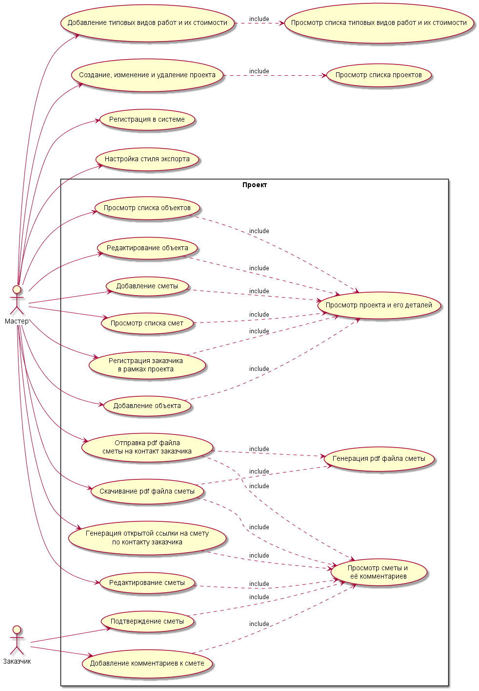
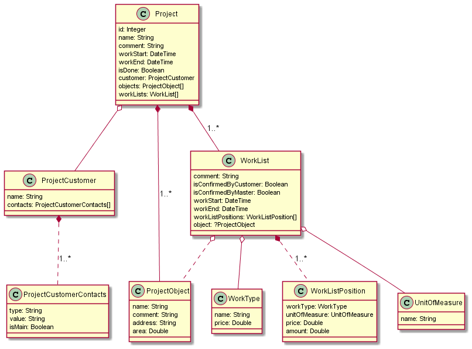

# Описание проекта

Web сервис по работе со сметами ремонтных работ. Их оформлению и отправки заказчику. Мастер добавляет проект, указывает заказчика. У проекта может быть несколько объектов, например различные комнаты или адреса. В рамках проекта создаются сметы работ, которые мастер может экспортировать в стилизованные pdf файлы и генерировать открытые для заказчика ссылки на сметы, где тот их может прокомментировать и утвердить.

# Основые понятия

[Глоссарий](./docs/glossary.md)

# Deploy

Настройки окружения, контейнеризации вынесены в отдельный [репозиторий](https://github.com/mrr000/docplace-deployment)
